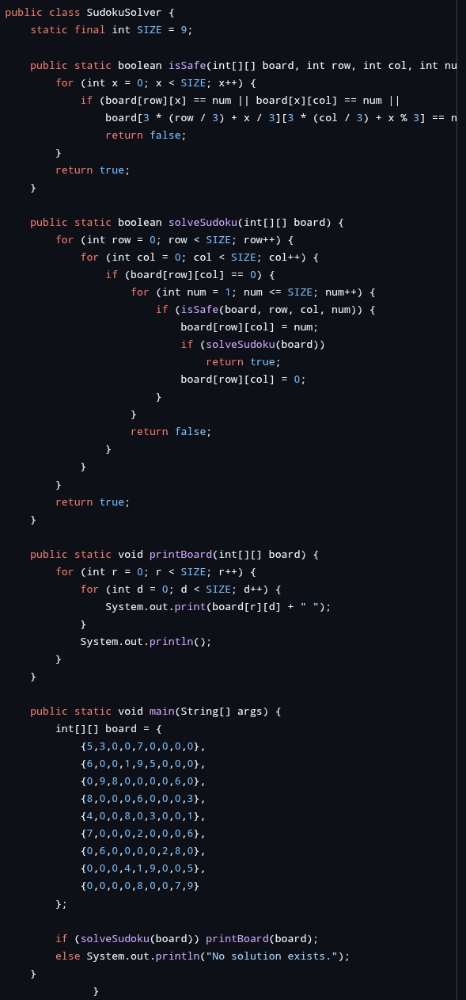
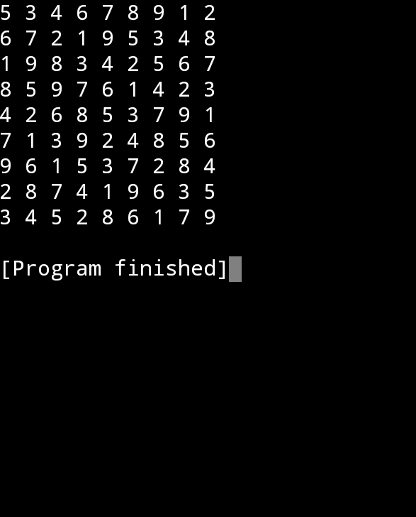

# Prodigy-infotech-task-4
Software development internship 
# Prodigy Infotech - Task 4 🚀

**Internship Domain**: Software Development  
**Task Title**: Temperature Converter using Java (GUI)  
**Intern Name**: Aravind Kumar G S  
**Repository**: [Prodigy-infotech-task-4](https://github.com/ARAVINDKUMARGS/Prodigy-infotech-task-4)

---

## 📌 Task Description
Developed a **Temperature Converter** application using **Java Swing GUI** that allows users to easily convert between:
- Celsius 🌡️
- Fahrenheit 🔥
- Kelvin ❄️

---

## 🧑‍💻 Technologies Used
- Java
- Java Swing (GUI Framework)
- IntelliJ IDEA / Eclipse (any IDE can be used)

---

## 💡 Features
- Simple and interactive graphical user interface (GUI)
- Real-time conversion upon input
- Dropdown menu to select units (Celsius, Fahrenheit, Kelvin)
- Clean and user-friendly layout

---

## 📷 Screenshots
>   
> 

---

## 📁 How to Run
1. Clone the repository:
   ```bash
   git clone https://github.com/ARAVINDKUMARGS/Prodigy-infotech-task-4
